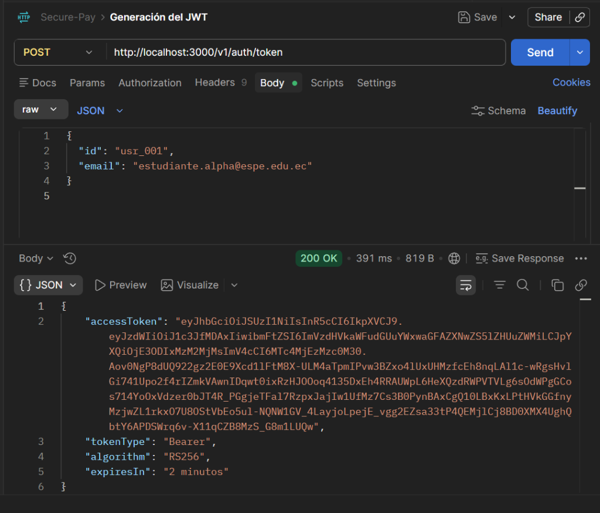
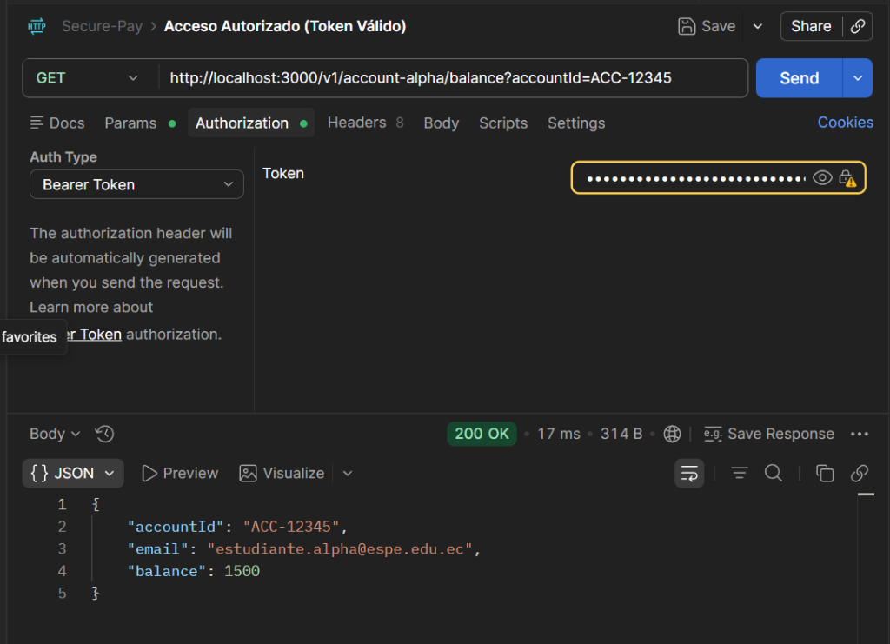
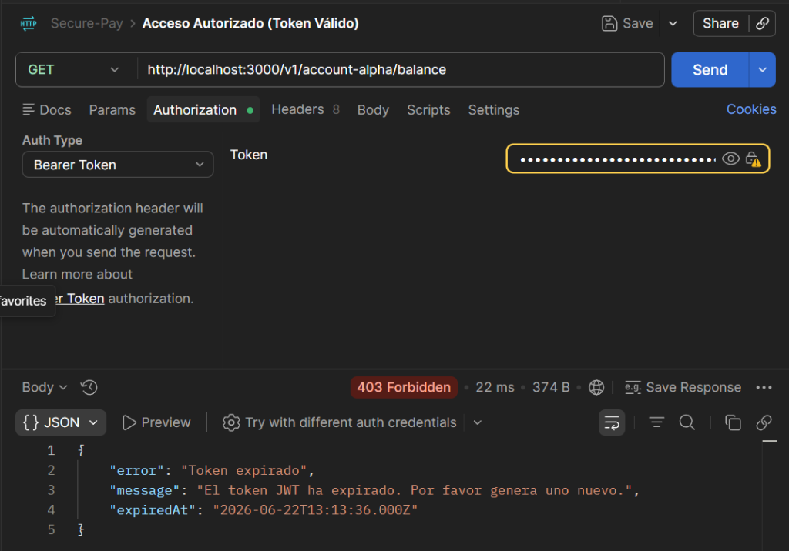
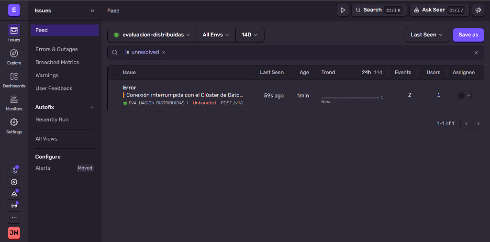
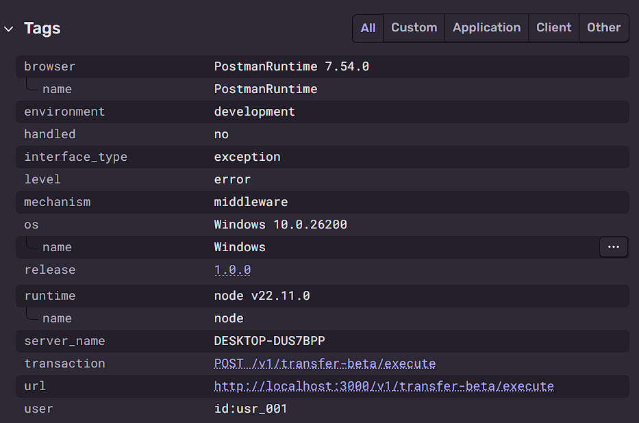

## Evidencias (Postman & Sentry)

### 1. Evidencia de Postman: Generación de JWT RS256

### 2. Evidencia de Postman: Acceso Autorizado (Token Válido)

### 3. Evidencia de Postman: Acceso Rechazado (Token Expirado / Inválido)

### 4. Evidencia de Panel de Sentry: Error Operacional 500

